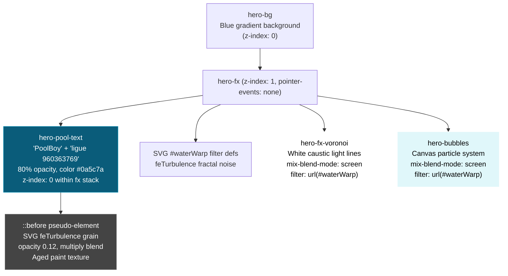

# Plan: Submerged Pool Floor Painted Text

## Goal

Remove the existing foreground hero text elements (brand title, subtitle, location) and replace them with "PoolBoy" and "ligue 960363769" that appear **painted directly onto the pool floor surface** — positioned _behind/underneath_ the water caustics, Voronoi light lines, and bubble effects — so the underwater refractions and water distortion pass naturally over the letters, creating a submerged painted look.

---

## Current Architecture (Hero Stack)

```
z-index hierarchy (low → high):
  hero-bg (gradient background + ::before sun-drift light)
  └── hero-fx (z-index: 1) — the effects stack layer
       ├── SVG #waterWarp filter defs (feTurbulence fractal noise)
       ├── hero-fx-voronoi (::before + ::after caustic light lines)
       └── hero-bubbles (particle canvas)
  └── hero-content (z-index: 10) — the text overlay
       ├── brand title (PoolBoy)
       ├── h1 headline (subtitle)
       └── location text
```

The hero section uses `isolation: isolate` and `position: relative` on the `<section>`. The `.hero-fx` layer sits at `z-index: 1` (absolutely positioned, pointer-events: none). The content sits at `z-index: 10` on top.

---

## Noise/Texture Already in the Hero

Investigation of the existing codebase reveals:

| Location                  | Technique                                             | Purpose                                                                             |
| ------------------------- | ----------------------------------------------------- | ----------------------------------------------------------------------------------- |
| `HeroEffects.jsx:173-186` | SVG `<feTurbulence type="fractalNoise">`              | Drives `feDisplacementMap` to warp Voronoi caustics and bubbles. Animates over 14s. |
| `src/index.css`           | No CSS noise/grain textures used anywhere in the hero | Only the SVG filter noise exists                                                    |

The existing noise is used **exclusively for displacement** (warping the Voronoi/bubble layers via `filter: url(#waterWarp)`). There is no static CSS noise or grain texture on any hero element.

**Implication:** For the "submerged paint" texture on the text, we'll use a CSS pseudo-element with an inline SVG `feTurbulence` data-URI — matching the project's existing fractal noise aesthetic but applied as a static grain texture instead of a live displacement animator.

---

## Required Changes

### Change 1: Remove existing foreground text from Hero.jsx

**File:** `src/components/Hero.jsx`

- Remove the `<div className="hero-content ...">` block (lines 20–64) entirely. This includes:
  - The brand title `<p>` with class `title-wave`
  - The `<h1>` subtitle with class `subtitle-wave`
  - The location `<p>` paragraph

- Keep the `<HeroEffects />` component and the `{children}` language slider.

### Change 2: Add "PoolBoy" + "ligue 960363769" painted text in HeroEffects.jsx

**File:** `src/components/HeroEffects.jsx`

Add a new absolutely-positioned text layer **inside** the `.hero-fx` div, **before** the SVG defs (so it sits below the Voronoi/bubble effects in DOM order). This is critical: the text must be rendered _before_ the Voronoi and bubble layers so those layers paint _over_ it.

New structure:

```jsx
<div className="hero-fx" aria-hidden="true">
  {/* NEW: Painted pool floor text — positioned behind caustics */}
  <div className="hero-pool-text">
    <span className="hero-pool-title">PoolBoy</span>
    <span className="hero-pool-sub">ligue 960363769</span>
  </div>

  {/* SVG filter defs — water warp */}
  <svg className="hero-fx-defs" ...>...</svg>

  {/* Voronoi cell pattern (warped by #waterWarp) — paints OVER the text */}
  <div className="hero-fx-voronoi" />

  {/* Micro-bubbles canvas */}
  <canvas ref={canvasRef} className="hero-bubbles" />
</div>
```

### Change 3: Add CSS for the submerged painted text

**File:** `src/index.css`

Add new CSS classes:

#### `.hero-pool-text` — positioning container

- `position: absolute; inset: 0;` — covers the full hero section
- `display: flex; flex-direction: column; align-items: center; justify-content: center;` — centers the text vertically/horizontally
- `z-index: 0;` — ensures it renders _behind_ the Voronoi (z-index: 1) but _above_ the background
- **Do NOT apply the `#waterWarp` filter here** — the text should not be distorted by the displacement map; it's the caustic overlay that creates the submerged look

#### `.hero-pool-title` + `.hero-pool-sub` — text styling

- **`.hero-pool-title`:** Satoshi font, weight 900, `clamp(48px, 12vw, 120px)`, letter-spacing -0.04em, line-height 1.1
- **`.hero-pool-sub`:** Inter font, weight 500, `clamp(20px, 4vw, 40px)`, letter-spacing 0.06em, margin-top 0.5em
- `color: #0a5c7a` — muted pool-floor teal that blends into the water gradient
- `opacity: 0.8` — as specified
- No text-shadow — painted text doesn't cast shadows

#### Noise texture for "submerged paint" effect (::before pseudo-element)

- **Technique:** Inline SVG data-URI using `<feTurbulence type="fractalNoise">` — same SVG filter primitive already used by the project for the water warp
- `opacity: 0.12`
- `mix-blend-mode: multiply`
- `pointer-events: none`
- This creates a subtle aged/grainy texture on the text area, simulating weathered pool paint

### Change 4: Remove unused CSS

**File:** `src/index.css`

- `.title-wave`, `.subtitle-wave`, and `@keyframes waveDistort` can be removed since they're no longer referenced by any DOM elements.

---

## Visual Reference — Layer Composition



---

## Detailed Steps for Implementation

| #   | File                             | Action                               | Details                                                                                                                                |
| --- | -------------------------------- | ------------------------------------ | -------------------------------------------------------------------------------------------------------------------------------------- |
| 1   | `src/components/Hero.jsx`        | **Remove hero-content div**          | Delete lines 19–64 (the entire `hero-content` block). Keep `HeroEffects` and `{children}`.                                             |
| 2   | `src/components/HeroEffects.jsx` | **Add painted text div**             | Insert `<div className="hero-pool-text">...` as the first child inside `.hero-fx`, before the SVG defs.                                |
| 3   | `src/index.css`                  | **Add `.hero-pool-text` styles**     | Positioning: absolute, inset 0, flex center, z-index: 0.                                                                               |
| 4   | `src/index.css`                  | **Add `.hero-pool-title` styles**    | Satoshi, weight 900, `clamp(48px, 12vw, 120px)`, color `#0a5c7a`, opacity 0.8.                                                         |
| 5   | `src/index.css`                  | **Add `.hero-pool-sub` styles**      | Inter, weight 500, `clamp(20px, 4vw, 40px)`, letter-spacing 0.06em, margin-top 0.5em, color `#0a5c7a`, opacity 0.8.                    |
| 6   | `src/index.css`                  | **Add noise texture pseudo-element** | `.hero-pool-text::before` with inline SVG `feTurbulence` noise data-URI, opacity 0.12, mix-blend-mode: multiply, pointer-events: none. |
| 7   | `src/index.css`                  | **Add reduced-motion support**       | Ensure no animations on the text layer; add to `@media (prefers-reduced-motion: reduce)` if needed.                                    |
| 8   | `src/index.css`                  | **Clean up**                         | Remove `.title-wave`, `.subtitle-wave`, and `@keyframes waveDistort` (no longer referenced).                                           |

---

## How the Submerged Illusion Works

1. **Painted text layer** sits at the bottom of `.hero-fx` with muted teal color and 80% opacity — looks like paint on the pool floor
2. **Caustic overlay** (`.hero-fx-voronoi`) renders on top with `mix-blend-mode: screen` — the glowing white light lines pass over the text
3. **Water warp** (`filter: url(#waterWarp)`) distorts the Voronoi and bubble layers, creating the undulating refraction effect over the text
4. **Noise grain** on the text's `::before` adds the aged/submerged paint texture
5. The text itself is **not warped** — only the light overlays above it are, which creates the natural illusion of physical paint viewed through moving water

---

## Text Color Reasoning

`#0a5c7a` is a muted teal-blue that:

- Sits between the gradient stops (`#14b3d4` → `#066a8c`) — feels like it belongs underwater
- Has low contrast with the background, simulating paint that's submerged
- Gets visually "picked up" by the white caustic overlay (screen blend mode naturally lightens it)
- At 80% opacity, the background gradient bleeds through subtly

---

## Questions for the User

1. **Responsive sizing** — Should "PoolBoy" use `clamp(48px, 12vw, 120px)` or a fixed size?
2. **Font pairing** — Satoshi (weight 900) for title, Inter (weight 500) for subtext? (Matches current hero convention.)
3. **Text color** — Muted teal `#0a5c7a` as proposed, or something else?
4. **Noise texture** — Now that we've confirmed the existing `feTurbulence` usage, use the same SVG noise primitive in a CSS data-URI for the aged paint grain?
